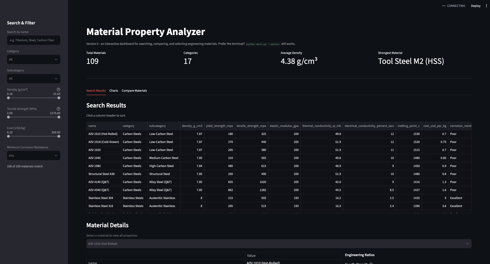

# Material Property Analyzer

A beginner-friendly Python tool for exploring and comparing engineering
materials - steels, aluminum and titanium alloys, ceramics, polymers,
composites, wood, and more - using real mechanical, thermal, electrical,
and cost properties.

It reads a CSV database of over 100 materials across 17 categories,
calculates the **strength-to-weight ratio** (and a few other useful
engineering ratios), ranks and compares materials, and generates
matplotlib charts to visualize the results. Version 5 adds an
interactive **Streamlit web dashboard** (`app.py`) on top of the same
engine - see [Version 5](#version-5-streamlit-web-dashboard) below - and
Version 6 adds **interactive Plotly Ashby charts** inside that
dashboard - see [Version 6](#version-6-interactive-ashby-charts) below.
Version 7 adds a **complete automated test suite** (200+ tests, 100%
code coverage) - see
[Version 7](#version-7-automated-testing-framework) below. Every
original command-line tool still works exactly as before, and still
uses the original matplotlib charts.

## Why this matters (materials engineering 101)

When engineers choose a material for a part, "strongest" is rarely the
right question - it's usually "strongest **for its weight**". A material
that is very strong but very dense (like some steels) can end up making a
heavier part than a lighter, moderately strong material like aluminum or
carbon fiber.

The key formula this project is built around:

```
strength-to-weight ratio = strength / density
```

This is also called **specific strength**. A higher value means the
material delivers more strength per gram - exactly what you want for
things like aircraft, bicycles, rockets, and drones, where every gram
counts. The same idea applies to **specific stiffness**
(`elastic modulus / density`), which matters when a part needs to resist
bending rather than just avoid breaking.

## Part 2: Advanced Material Selection

Part 1 lets you rank and compare materials by a single property at a
time. Part 2 adds a full **material selection system** that mirrors how
engineers actually choose materials: first **filter** out anything that
can't do the job, then **rank** what's left by how well it fits several
competing goals at once (strength, stiffness, and cost together).

### New features

- **`src/selection_engine.py`** - filters materials by hard requirements
  (max density, min strength, max cost, category, ...) and ranks the
  survivors using a weighted score. Includes ready-made goal presets:
  - `lightweight_strength` - best strength-to-weight ratio (aircraft,
    drones, bike frames)
  - `rigid_structure` - best stiffness-to-weight ratio (beams,
    brackets, tooling)
  - `budget_friendly` - most strength per dollar (mass-produced parts)
  - `balanced` - an even mix of all three
- **`src/scoring.py`** - normalizes engineering ratios onto a common
  0-100 scale and combines them into one overall **match score** using
  a weighted decision matrix. Includes dedicated **specific strength**
  and **specific stiffness** scores.
- **`src/cli.py`** - an interactive command-line interface: pick a
  selection goal and optional requirements by answering plain-English
  prompts, and get back a ranked shortlist - no Python required.

## Version 4: Advanced Search & Filtering

Part 2 finds the single *best* material for a goal. Version 4 adds a
complementary tool for a different job: **browsing and exploring** the
catalog by searching, filtering, and sorting - useful for looking up a
specific alloy, checking every material in a category, or building a
shortlist by hand.

### New features

- **`src/search.py`** - the Version 4 search & filtering engine:
  - **Search** by `name`, `category`, or `subcategory` (every material
    now has a subcategory, e.g. "6xxx Series (Al-Mg-Si)" within
    "Aluminum Alloys", or "Austenitic Stainless" within "Stainless
    Steels" - see `data/materials.csv`).
  - **Filter** by range on any of: density, yield strength, tensile
    strength, elastic modulus (stiffness), thermal conductivity,
    electrical conductivity, melting point, and relative cost - plus a
    minimum **corrosion resistance** rating.
  - **Combine** any number of search terms and filters at once - they
    all narrow the same result set together.
  - **Sort** by density, strength, stiffness, cost, specific strength,
    or specific stiffness (ascending/descending, with a sensible
    default direction per property).
  - **Database statistics** (`get_statistics` / `print_statistics`) -
    total material count, per-category counts, average density and
    strength, and the current "record holders" for strongest, lightest,
    and cheapest material.
- **`src/cli.py`** now opens with a main menu so you can jump straight
  to the material selector (Part 2), the new search & filter tool, or
  database statistics - all from one interactive session.

### Using the search engine yourself

```python
from src.database import MaterialDatabase
from src.search import SearchEngine

db = MaterialDatabase("data/materials.csv")
engine = SearchEngine(db.data)

# Search by name, category, and/or subcategory (case-insensitive
# substring match) - all given terms must match.
results = engine.search(category="Aluminum", subcategory="7xxx")
print(results)

# Filter by one or more property ranges at once. Every *_range is a
# (min, max) tuple - either side can be None for "no limit".
results = engine.search(
    density_range=(None, 5.0),          # g/cm3
    tensile_strength_range=(400, None), # MPa
    relative_cost_range=(None, 20.0),   # USD/kg
    corrosion_resistance="Good",        # "Good" or better
)
print(results)

# Combine search + filters + sorting in a single call.
results = engine.search(
    category="Titanium",
    yield_strength_range=(700, None),
    sort_by="specific_strength",   # density, strength, stiffness,
    top_n=5,                       # cost, specific_strength,
)                                  # or specific_stiffness
print(results)
```

Every recognized range-filter keyword: `density_range`,
`yield_strength_range`, `tensile_strength_range`,
`elastic_modulus_range`, `thermal_conductivity_range`,
`electrical_conductivity_range`, `melting_point_range`,
`relative_cost_range`.

### Database statistics

```python
from src.database import MaterialDatabase
from src.search import get_statistics, print_statistics

db = MaterialDatabase("data/materials.csv")

print_statistics(db.data)   # pretty-printed summary

stats = get_statistics(db.data)
print(stats["total_materials"], "materials")
print(stats["strongest_material"], stats["lightest_material"], stats["cheapest_material"])
```

### Searching interactively

```bash
python main.py --select
```

Then choose **"Search & filter materials"** from the menu: answer a
few plain-English prompts (search terms, then optional property
ranges, corrosion resistance, and sort order) to get a matching list
of materials - or choose **"Database statistics"** for the summary
above.

## Version 5: Streamlit Web Dashboard

Version 5 adds `app.py`, an interactive browser dashboard built with
[Streamlit](https://streamlit.io/). It's a thin UI layer on top of the
exact same modules used by the CLI (`database.py`, `search.py`,
`comparator.py`, `visualizer.py`, ...) - no engineering logic is
duplicated, so the CLI and the dashboard always stay in sync.



### Running the dashboard

```bash
streamlit run app.py
```

This opens the dashboard in your browser at `http://localhost:8501`.
Run it from the project root (same place you'd run `python main.py`).

### What's in the dashboard

- **Summary cards** - total materials, category count, average density,
  and the current strongest material at a glance.
- **Sidebar search & filters** - a text search box, category and
  subcategory dropdowns, sliders for density/strength/cost ranges, and
  a minimum corrosion-resistance selector. All filters combine, exactly
  like `SearchEngine.search()` in `src/search.py`.
- **Search Results tab** - a sortable results table (click any column
  header to sort) and a material detail view showing every raw
  engineering property plus the specific strength, specific stiffness,
  and relative cost index for whichever material you select.
- **Charts tab** - interactive Plotly versions of the specific-strength
  ranking and strength-vs-density charts (see
  [Version 6](#version-6-interactive-ashby-charts)), redrawn live for
  whatever the sidebar currently filters to, plus a dropdown of four
  more Ashby-chart property combinations.
- **Compare Materials tab** - pick up to three materials for a
  side-by-side table (raw properties + engineering ratios) and the
  matching grouped-bar comparison chart.

The original CLI keeps working unchanged - `python main.py` and
`python main.py --select` are unaffected by the dashboard.

## Version 6: Interactive Ashby Charts

Version 6 adds `src/interactive_charts.py` and replaces every chart in
the dashboard's **Charts** tab with an interactive
[Plotly](https://plotly.com/python/) version instead of matplotlib -
including the specific-strength ranking bar chart and the classic
strength-vs-density scatter, not just the property combinations reached
through the chart-picker dropdown. An Ashby chart plots one material
property against another (usually on log-log axes) so that entire
material families cluster into visible regions - engineers scan for the
region matching their constraints instead of comparing table rows one
by one.

- **Always-visible charts**: the specific-strength ranking (a bar
  chart, colored and grouped by category the same way as the scatter
  charts) and the classic strength-vs-density scatter.
- **"More Ashby Charts" dropdown** with six property-combination
  presets (including Strength vs. Density again, for comparing it
  under different axis settings than the fixed chart above): Strength
  vs. Density, Young's Modulus vs. Density, Thermal Conductivity vs.
  Density, Cost vs. Strength, Specific Strength vs. Cost, and Specific
  Stiffness vs. Cost.
- **Hover tooltips** on every point show the material's name, category,
  subcategory, density, yield strength, tensile strength (UTS), Young's
  modulus, and relative cost - no need to cross-reference the table.
- **Color by category**, using the same `CATEGORY_COLORS` palette as
  the static matplotlib charts, so a category is the same color
  everywhere in the project.
- **Click a legend entry to hide/show that category** (double-click to
  isolate just one) - built into Plotly, no extra controls needed.
- **Log X / Log Y checkboxes** toggle each axis between logarithmic
  (the Ashby-chart default, since these properties span orders of
  magnitude) and linear.
- **PNG export** via the camera icon in the chart's toolbar - no
  server-side dependency required.

Like every other chart in this project, the Ashby charts are built from
`add_calculated_columns()` (`src/calculations.py`) over whatever table
you pass in - the dashboard passes the same filtered `results` produced
by `SearchEngine.search()`, so an Ashby chart always matches the
sidebar's current search & filter selection. The original matplotlib
charts (`src/visualizer.py`) are untouched and still power `python
main.py`.

## Version 7: Automated Testing Framework

Version 7 adds a complete `pytest` test suite under `tests/` - **206
tests, 100% code coverage** across every module in `src/` and `app.py`
- without changing any existing behavior. Nothing in `src/`, `app.py`,
or `main.py` was modified to add this; the tests document and verify
the system exactly as Versions 1-6 built it.

### Running the tests

1. **Install the dev dependencies** (adds `pytest` and `pytest-cov` on
   top of the regular `requirements.txt`):

   ```bash
   pip install -r requirements-dev.txt
   ```

2. **Run the whole suite:**

   ```bash
   pytest
   ```

   `pytest.ini` is already configured to run every test in `tests/`,
   print a coverage summary after the run, write an HTML coverage
   report to `htmlcov/`, and **fail the run if coverage drops below
   90%** (`--cov-fail-under=90`). Open `htmlcov/index.html` in a
   browser for a line-by-line, click-through coverage report.

3. **Run a single test file** (useful while working on one module):

   ```bash
   pytest tests/test_search.py -v
   ```

4. **Run tests matching a name pattern:**

   ```bash
   pytest -k "corrosion"
   ```

### What's tested, and how the suite is organized

| File | What it covers |
|---|---|
| `tests/conftest.py` | Shared fixtures: a small hand-built 4-material dataset (`sample_df`) with round numbers chosen so every ratio can be verified by hand, a temp-file CSV version of it, and fixtures for the real `data/materials.csv` |
| `tests/test_database.py` | Unit tests for `database.py` - loading, validation, lookup, add, save |
| `tests/test_calculations.py` | Unit tests for `calculations.py` - every formula, plus edge cases (zero/negative density) |
| `tests/test_comparator.py` | Unit tests for `comparator.py` - compare, rank_by, and the convenience shortcuts |
| `tests/test_scoring.py` | Unit tests for `scoring.py` - normalization and the weighted decision matrix, using a fixture engineered so every score lands on a round 0/50/100 |
| `tests/test_search.py` | Unit tests for `search.py` - text search, range/corrosion filters, sorting, `SearchEngine`, and `get_statistics` |
| `tests/test_selection_engine.py` | Unit tests for `selection_engine.py` - the filter funnel and goal-based `SelectionEngine` |
| `tests/test_integration.py` | **Integration tests** against the *real* `data/materials.csv`: load → search → filter → rank → compare, checking the contracts between modules rather than hard-coding today's data |
| `tests/test_validation.py` | **Validation tests**: invalid data (missing columns, bad formulas), empty search results, formula correctness across module boundaries, duplicate material names, and missing/NaN values |
| `tests/test_app.py` | **Streamlit `AppTest`** tests for `app.py`: dashboard loading, search & filtering, material details, and the compare-materials flow, run against the real app script (no mocking of Streamlit itself) |
| `tests/test_cli.py` | Unit tests for `cli.py`'s interactive menu, scripting `input()` with canned answers |
| `tests/test_visualizer.py` | Unit tests for the matplotlib chart functions (CLI output) |
| `tests/test_interactive_charts.py` | Unit tests for the Plotly Ashby/ranking chart builders (Version 6) |

### Coverage configuration

- **`pytest.ini`** wires up `pytest-cov` (`--cov=src --cov=app`) with
  a terminal summary, an HTML report, and a 90% minimum gate.
- **`.coveragerc`** excludes the standard `if __name__ == "__main__":`
  entry-point guard from coverage accounting (there's nothing
  meaningful to unit-test in a bare `run()` call at import time).

## Project structure

```
material-property-analyzer/
├── data/
│   └── materials.csv          # Sample materials database
├── output/                    # Generated charts land here (gitignored)
├── src/
│   ├── __init__.py
│   ├── database.py            # Load/query/add materials from CSV
│   ├── calculations.py        # Strength-to-weight & other formulas
│   ├── comparator.py          # Rank and compare materials
│   ├── visualizer.py          # matplotlib chart generation
│   ├── scoring.py             # Part 2: 0-100 scores & weighted match score
│   ├── selection_engine.py    # Part 2: filter + rank materials by goal
│   ├── search.py              # Version 4: search, filter, sort & stats
│   ├── cli.py                 # Interactive menu: selector, search, stats
│   └── interactive_charts.py  # Version 6: Plotly interactive Ashby charts
├── tests/                     # Version 7: pytest suite (206 tests, 100% coverage)
│   ├── conftest.py            # Shared fixtures (sample data, real-CSV fixtures)
│   ├── test_database.py
│   ├── test_calculations.py
│   ├── test_comparator.py
│   ├── test_scoring.py
│   ├── test_search.py
│   ├── test_selection_engine.py
│   ├── test_integration.py    # Full-stack workflows against real data
│   ├── test_validation.py     # Invalid data, empty results, duplicates, NaNs
│   ├── test_app.py            # Streamlit AppTest: dashboard behavior
│   ├── test_cli.py
│   ├── test_visualizer.py
│   └── test_interactive_charts.py
├── htmlcov/                    # Generated coverage report (gitignored)
├── main.py                    # Run the full analysis end-to-end
├── app.py                     # Version 5-6: Streamlit web dashboard
├── requirements.txt
├── requirements-dev.txt       # Version 7: pytest + pytest-cov
├── pytest.ini                 # Version 7: pytest & coverage configuration
├── .coveragerc                # Version 7: coverage.py exclusions
├── .gitignore
└── README.md
```

## Getting started

1. **Create a virtual environment (recommended):**

   ```bash
   python -m venv venv
   source venv/bin/activate   # On Windows: venv\Scripts\activate
   ```

2. **Install dependencies:**

   ```bash
   pip install -r requirements.txt
   ```

3. **Run the analyzer:**

   ```bash
   python main.py
   ```

   This will print material rankings and comparisons to the terminal,
   save three charts into `output/`, and finish with a demo of the Part 2
   selection engine and the Version 4 search & filter tool / database
   statistics:

   - `strength_to_weight_ranking.png` - bar chart ranking materials by
     specific strength
   - `strength_vs_density.png` - a classic "materials selection" scatter
     chart (strength vs. density, colored by category)
   - `material_comparison.png` - a normalized side-by-side comparison of
     hand-picked materials

4. **Or, use the interactive CLI (material selector, search & filter,
   database statistics):**

   ```bash
   python main.py --select
   ```

   This skips the demo report and opens a menu where you can:
   - run the Part 2 **material selector** - choose a selection goal
     (e.g. "lightweight & strong") and optional requirements (max
     cost, max density, category, ...), then get a ranked shortlist;
   - run the Version 4 **search & filter tool** - search by name,
     category, or subcategory, filter by any number of property
     ranges or corrosion resistance, and sort the results; or
   - view Version 4 **database statistics** - category counts,
     averages, and the strongest/lightest/cheapest material.

   You can also run it directly with `python -m src.cli`.

5. **Or, launch the Version 5 Streamlit web dashboard:**

   ```bash
   streamlit run app.py
   ```

   Opens an interactive browser dashboard with search & filtering, a
   sortable results table, a material detail view, live charts
   (including interactive Plotly Ashby charts - see
   [Version 6](#version-6-interactive-ashby-charts)), and a three-way
   comparison mode. See
   [Version 5: Streamlit Web Dashboard](#version-5-streamlit-web-dashboard)
   above for details.

6. **Or, run the automated test suite:**

   ```bash
   pip install -r requirements-dev.txt
   pytest
   ```

   Runs all 206 tests with a coverage summary. See
   [Version 7: Automated Testing Framework](#version-7-automated-testing-framework)
   above for details.

## The materials database (`data/materials.csv`)

The database contains **109 engineering materials across 17 categories**:

Carbon Steels, Stainless Steels, Tool Steels, Aluminum Alloys, Titanium
Alloys, Magnesium Alloys, Copper Alloys, Nickel Alloys, Cast Irons,
Ceramics, Glass, Polymers, Elastomers, Composites, Wood, Concrete, and
Natural Materials.

Each row describes one material with these columns:

| Column | Meaning | Units / notes |
|---|---|---|
| `name` | Material name, e.g. "Aluminum 6061-T6" | - |
| `category` | One of the 17 categories listed above | - |
| `subcategory` | A finer classification within the category, e.g. "6xxx Series (Al-Mg-Si)" within "Aluminum Alloys" - added in Version 4 to support searching | - |
| `density_g_cm3` | Mass per unit volume | g/cm³ |
| `yield_strength_mpa` | Stress at which the material starts to permanently deform | MPa |
| `tensile_strength_mpa` | Ultimate tensile strength - the stress at which the material breaks | MPa |
| `elastic_modulus_gpa` | Young's modulus - stiffness, i.e. resistance to elastic stretching/bending | GPa |
| `poisson_ratio` | How much a material narrows sideways when stretched lengthwise | unitless, typically 0-0.5 |
| `hardness_value` | Resistance to surface indentation/scratching | see `hardness_scale` |
| `hardness_scale` | Which hardness scale `hardness_value` is measured on | HB, HRC, HV, Shore A, Shore D, Mohs, Janka, or Barcol - see below |
| `thermal_conductivity_w_mk` | How well the material conducts heat | W/(m·K) |
| `electrical_conductivity_percent_iacs` | Electrical conductivity relative to pure annealed copper | %IACS (copper = 100%, insulators ≈ 0%) |
| `melting_point_c` | Melting point, or an approximate softening/decomposition temperature for materials without a sharp melting point (see note below) | °C |
| `fatigue_strength_mpa` | Approximate stress the material can survive for ~10 million load cycles without breaking | MPa |
| `cost_usd_per_kg` | Approximate raw material cost | USD/kg |
| `corrosion_resistance` | Rough qualitative rating | Poor, Fair, Good, or Excellent |

Loading the database through `src/database.py` also gives you a derived
`relative_cost_index` column (via `add_calculated_columns`) - see
[Key formulas used](#key-formulas-used) below.

### About the hardness scales

Different material families are conventionally measured on different
hardness scales, so this project keeps the raw scale alongside the
value instead of forcing everything onto one number:

| Scale | Used for | Typical range in this dataset |
|---|---|---|
| **HB** (Brinell) | Most metals (steels, aluminum, copper, magnesium, nickel, cast iron) | ~20-500 |
| **HRC** (Rockwell C) | Hardened tool steels and some hardened alloys | ~40-65 |
| **HV** (Vickers) | Technical ceramics (too hard for a Brinell indenter) | ~1,200-3,000 |
| **Shore D** | Rigid plastics | ~45-90 |
| **Shore A** | Soft rubbers/elastomers, and a few soft natural materials | ~30-85 |
| **Mohs** | Glass, concrete, and other mineral-based brittle materials | ~3-7 |
| **Janka** (lbf) | Wood - the force needed to embed a steel ball halfway into the wood | ~90-1,450 |
| **Barcol** | Fiber-reinforced composites | ~40-60 |

### A note on data sources and accuracy

Every value in `data/materials.csv` is an **approximate, representative
figure** drawn from commonly used materials-engineering references
(handbook-style typical values, e.g. ASM Handbook-style data and
manufacturer datasheet ranges), not a certified test result. Real
material properties vary by supplier, heat treatment, temper, and test
method. A few columns need extra context because not every material
family fits neatly into "strength" and "melting point":

- **Brittle materials** (ceramics, glass, cast irons like White Cast
  Iron) don't have a true yield point - they crack instead of bending.
  For these rows, `yield_strength_mpa` is set equal to
  `tensile_strength_mpa` (approximated by flexural/fracture strength).
- **Materials without a sharp melting point** - polymers, elastomers,
  wood, concrete, and natural materials - don't melt the way a metal
  does. `melting_point_c` for these rows is an approximate
  softening, decomposition, or ignition temperature instead.
- **This data is for learning and experimentation only** - do not use
  it for real engineering design work. Always consult a certified
  datasheet or run your own testing for anything load-bearing.

### Adding your own materials

You can edit `data/materials.csv` directly in a spreadsheet program, or use
Python:

```python
from src.database import MaterialDatabase

db = MaterialDatabase("data/materials.csv")
db.add_material(
    name="Rattan (Bamboo Cane)",
    category="Wood",
    subcategory="Bamboo",
    density_g_cm3=0.7,
    yield_strength_mpa=100,
    tensile_strength_mpa=140,
    elastic_modulus_gpa=20,
    poisson_ratio=0.3,
    hardness_value=1000,
    hardness_scale="Janka",
    thermal_conductivity_w_mk=0.15,
    electrical_conductivity_percent_iacs=0,
    melting_point_c=300,
    fatigue_strength_mpa=40,
    cost_usd_per_kg=1.2,
    corrosion_resistance="Fair",
)
db.save()  # writes back to data/materials.csv
```

## Using the modules yourself

```python
from src.database import MaterialDatabase
from src.comparator import MaterialComparator

db = MaterialDatabase("data/materials.csv")
comparator = MaterialComparator(db.data)

# Rank all materials by strength-to-weight ratio
print(comparator.best_strength_to_weight(top_n=5))

# Compare specific materials side by side
print(comparator.compare(["Aluminum 6061-T6", "Titanium Ti-6Al-4V"]))
```

### Using the Part 2 selection engine

```python
from src.database import MaterialDatabase
from src.selection_engine import SelectionEngine

db = MaterialDatabase("data/materials.csv")
engine = SelectionEngine(db.data)

# Use a ready-made goal preset ("lightweight_strength", "rigid_structure",
# "budget_friendly", or "balanced") plus optional hard requirements.
shortlist = engine.select(
    goal="lightweight_strength",
    categories=["Aluminum Alloys", "Titanium Alloys", "Composites"],
    max_cost=25.0,       # USD/kg
    max_density=5.0,     # g/cm3
    top_n=5,
)
print(shortlist)

# Or supply your own custom weights instead of a preset - weights don't
# need to add up to 1, they're normalized automatically.
custom_shortlist = engine.select(
    weights={
        "specific_strength_score": 0.5,
        "specific_stiffness_score": 0.3,
        "cost_score": 0.2,
    },
    max_cost=10.0,
)
print(custom_shortlist)
```

## Key formulas used

- **Specific strength (strength-to-weight ratio):** `strength / density`
  - Higher is better when minimizing weight matters most.
- **Specific stiffness:** `elastic_modulus / density`
  - Higher is better when resisting bending/flex matters most.
- **Cost per unit strength:** `cost_per_kg / tensile_strength`
  - Lower is better when budget is the priority.
- **Relative cost index:** `cost_per_kg / 1.0 USD` (the approximate price
  of plain structural carbon steel)
  - A value of 20 means "about 20x the price of basic carbon steel" -
    handy for comparing cost across very differently priced materials
    (e.g. wood vs. titanium) without caring about market price swings.

See the comments in `src/calculations.py` for a deeper explanation of each
concept.

### Part 2 formulas: normalized scoring & weighted matching

The selection engine can't compare "MPa per g/cm3" directly against "USD
per MPa" - they're different units. It solves this in two steps, both
explained in detail in `src/scoring.py`:

**1. Normalize each property onto a 0-100 scale** (min-max normalization):

```
score = 100 * (value - worst) / (best - worst)
```

The best material for that property scores 100, the worst scores 0, and
everything else falls proportionally in between. For "lower is better"
properties like cost, the direction is flipped so the *cheapest* material
still scores highest.

**2. Combine scores into one overall match score** (a weighted decision
matrix):

```
match_score = (strength_score * strength_weight
             + stiffness_score * stiffness_weight
             + cost_score * cost_weight)
             / (strength_weight + stiffness_weight + cost_weight)
```

Each weight represents how much that property matters for the part
you're designing. A bike frame might weight specific strength heavily
and barely care about cost; a mass-produced bracket might do the
opposite. Changing the weights changes the ranking - that's the whole
point of a weighted decision matrix.

## Learning goals

This project is intentionally kept simple and heavily commented so it can
be used as a learning tool for:

- Reading/writing CSV data with `pandas`
- Structuring a small Python project into modules
- Applying basic engineering formulas in code
- Creating charts with `matplotlib`
- Normalizing and combining metrics with a weighted decision matrix
- Building a simple interactive command-line interface
- Working with a larger, multi-property real-world-style dataset

Feel free to extend it further - more materials, temperature-dependent
properties, saving/loading custom weight presets, or scoring by thermal
or electrical conductivity would all be natural next steps.
